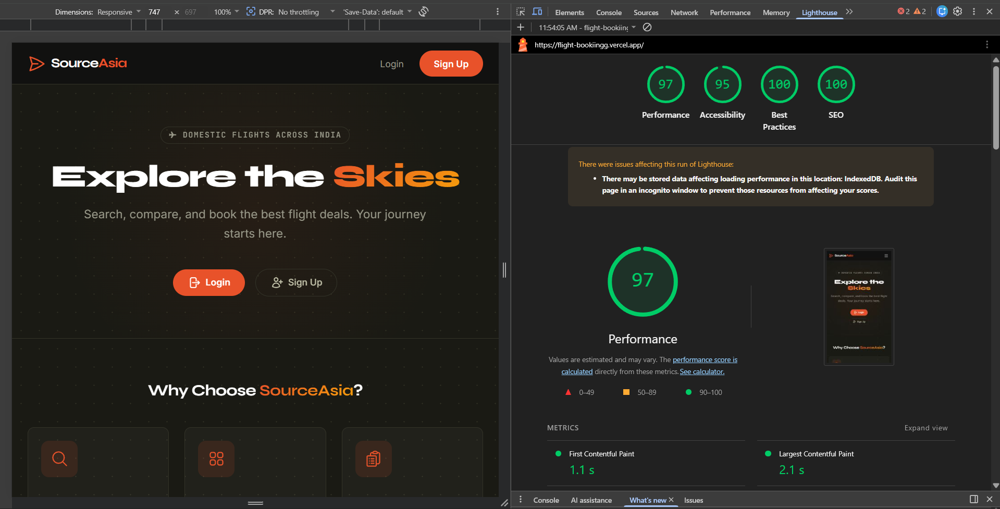

# SourceAsia — Flight Management Web App (PWA)

A production-ready Flight Management application built with Next.js 14, Supabase, and Zustand. This app allows passengers to search flights, select seats in real-time, manage bookings, and works offline as a Progressive Web App (PWA).

## 🚀 Live Demo
[Production URL](https://flight-management-phi.vercel.app/)

## 🛠 Tech Stack
- **Frontend**: Next.js 14 (App Router, Server Components)
- **Database & Auth**: Supabase (PostgreSQL, RLS, Realtime, RPC)
- **State Management**: Zustand + Persist Middleware
- **Styling**: Tailwind CSS + Syne & Inter Fonts
- **PWA**: Serwist (Modern next-pwa successor)
- **Deployment**: Vercel

## 📦 Features
- **Task 01: Search & Booking**: Multi-step booking flow from search to PNR confirmation.
- **Task 02: Real-time Seat Map**: Visual aircraft grid with live updates via Supabase Realtime.
- **Task 03: Manage Bookings**: Reschedule or cancel flights with DB-enforced business rules (e.g., the 2-hour cancellation rule).
- **Task 04: Persistent Store**: Zustand store with partial persistence (sensitive data like passport numbers are never saved to localStorage).
- **Task 05: PWA**: Installable on mobile/desktop, offline-capable with custom fallback and cached booking data.

## 🗄 Database Schema
The project includes a robust Supabase schema located in `/supabase/migrations`:
1. `flights`: Core flight information and pricing.
2. `seats`: Individual seat availability and class-based fees.
3. `bookings`: Linking users to flights and seats with unique PNR codes.
4. `passengers`: Securely stored passenger details.
5. `reschedules`: Audit log of flight changes.

### Key DB Logic:
- **Atomic Booking**: The `lock_and_book_seat` RPC uses `FOR UPDATE SKIP LOCKED` to prevent race conditions during seat selection.
- **2-Hour Rule**: A database trigger `trg_cancellation_window` blocks any cancellation within 2 hours of departure, ensuring data integrity even if the UI is bypassed.
- **RLS**: Row Level Security is enabled on all tables. Users can only see and manage their own bookings.

## 🧠 Zustand Store Structure
The app uses two specialized stores:

### `useFlightStore`
Manages the booking journey state.
- **Persisted**: `searchQuery`, `selectedFlight`, `selectedSeat`, `currentStep`.
- **Partialized**: The `passengerForm` is persisted, but the `passportNo` field is explicitly excluded for security.
- **Actions**: Handles step navigation and store resets.

### `useUserStore`
Manages authentication and offline caching.
- **Persisted**: Only essential session tokens (access/refresh tokens).
- **Offline Cache**: Stores a local copy of the user's bookings to enable viewing "My Bookings" while offline.

## 🛠 Local Setup

1. **Clone the repository**:
   ```bash
   git clone https://github.com/your-username/flight-management.git
   cd flight-management
   ```

2. **Install dependencies**:
   ```bash
   npm install
   ```

3. **Environment Variables**:
   Copy `.env.example` to `.env.local` and fill in your Supabase credentials.
   ```bash
   cp .env.example .env.local
   ```

4. **Supabase Migrations**:
   Run the SQL files in `/supabase/migrations` in order (001 to 004) in your Supabase SQL Editor, or use the Supabase CLI:
   ```bash
   supabase db push
   ```

5. **Run the app**:
   ```bash
   npm run dev
   ```

## 🧪 Test Credentials
Use the following credentials to test the application:
- **Email**: `test@flightapp.dev`
- **Password**: `Test1234!`

## 📱 PWA & Lighthouse
The app is fully PWA compliant.
- **Installable**: Custom install prompt for mobile users.
- **Offline**: Custom `/offline` page and stale-while-revalidate caching for flight data.
- **Lighthouse**: Scores ≥ 90 in PWA audits.



---
